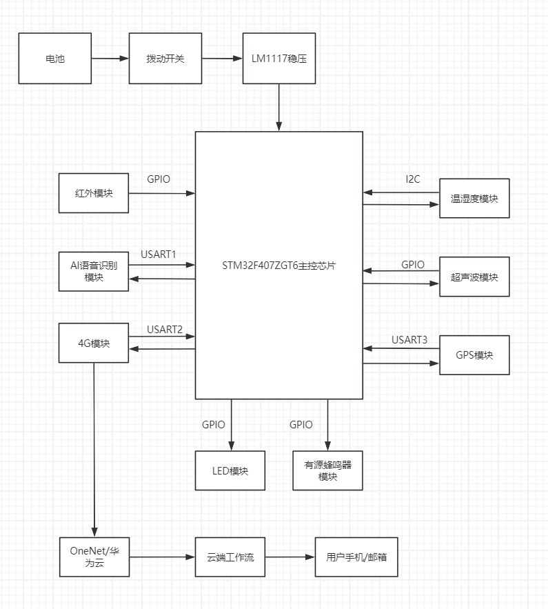

# 0214_Proposal

#### 文档的结构如下：
#### 第一部分：项目简介
#### 第二部分：实现功能（核心场景与优先级）
#### 第三部分：设备架构（硬件与系统布局）
#### 第四部分：任务拆解（项目的预期进展）
#### 第五部分：参赛备注（策略与建议）
#### 第六部分：当前任务（立刻要做的）

---
## 第一部分：项目简介
### 1.1 项目名称
- **中文名：** 户外露营安全智能环境感知系统
- **英文名：** Intelligent Environmental Perception System for Outdoor Camping Safety 
- **别名：** Perceptive Camping Safety Device

### 1.2 项目方向
- **核心理念：** 以**安全监测**为核心，**剔除**单纯提升舒适性的功能（如氛围灯、娱乐语音交互），打造野外生存的“数字哨兵”。

- **解决痛点：** 针对户外露营中面临的**生物入侵、极端天气突变、一氧化碳中毒/失温、离网失联**以及**夜间迷路**等真实安全威胁。

- **技术亮点：** 
  - 结合多传感器融合（合泰杯）
  - 端侧 AI 分析（TinyML）与离网通讯技术（LoRa/北斗）（嵌入式）
---
## 第二部分：实现功能

### P0（必做）
1. **生物入侵检测（恒温）（冷血）**
    - **红外扫描：** 360 红外传感器检测热源变化（恒温）
    - **AI 分析：** 端侧AI分析传感器数据特征，过滤风吹草动的误报（嵌入式AI的体现）
    - 超声波探测： 用于识别响尾蛇等特殊小型动物（非核心可取舍）
2. **生命体征监测**
    - **CO浓度监测**
    - **结露风险预警：** 结合温湿度计算 **“露点温度”** ，防止结露导致睡袋打湿失温
3. **极端天气感知**
    - 突发**暴雨、降温、气压骤变：** 集成温湿度气压传感器，建立本地天气模型
4. **多级预警系统**
    - **本地报警：** 高声蜂鸣器 + 高亮频闪
    - **远程报警：定位**上报
      - **北斗短报文**
      - **4/5G推送**
      - LoRa广播（嵌入式）
### P1（重点）
1. **手机APP可视化**，同步预警
    - 简易DashBoard，显示温湿度曲线、电量、位置、报警日志（不必过于复杂）
2. **电源管理系统**
    - **太阳能**白天补能
    - **动态功耗：**
      - 夜间全功率运行
      - 白天休眠
      - 确保**整夜续航**
### P2（拓展）
1. 离网通讯组网
    - LoRa Mesh：实现几公里内的设备互联与数字/位置广播
2. 结构健康监测
    - 利用姿态传感器监测杆的震动频率，AI区分“风吹晃动”与“塑性形变”
---
## 第三部分：设备架构

### 3.1 硬件模块架构
采取模块化设计，主控负责调控各子模块
- **核心主控：**
  - MCU：
    - 合泰单片机（合泰杯试水）
    - STM32或ESP32（嵌入式运行AI）
- **环境感知层：**
  - 温湿气压传感器
  - CO传感器
  - 光照传感器
- **安全探测层：**
  - 360红外 或 热成像阵列
  - 超声波模块
  - IMU 姿态传感器
- **交互与通讯层**
  - 北斗、GPS模组（定位）
  - 4/5G模组（物联网通讯）
  - 声光报警器（高声蜂鸣器 + 爆闪LED）
  - LoRa 射频模块（离网通讯）
- **电源层：**
  - 锂电池组 + 太阳能板 + 电源管理芯片
### 3.2 系统物理布局
为了最大化探测效率，系统分为三个物理部分：

1. **外部信标 (The Beacon)：**
位置： 使用伸缩杆立于帐篷外 1-2 米处。
功能： 承载 360° 红外扫描、超声波、LoRa 天线、太阳能板。视野最开阔。

2. **顶部主控 (The Brain)：**
位置： 帐篷顶部挂钩处（原营地灯位置）。
功能： 承载环境传感器（最能代表帐内空气质量）、姿态传感器、主控 MCU。

- 2+. 或者将外部信标和顶部主控**集成**，都放置在帐篷顶部

3. **内部电源 (The Power)：**
位置： 帐篷角落或地垫下。
功能： 较重的电池组，通过线缆向顶部和外部供电。

---
## 第四部分：任务拆解
- 类别：
  - 软件
    - 软件（主控与模块的软件连接）
    - 环境
    - 算法（逻辑）
  - 硬件
    - 硬件（PCB，主控与模块的物理连接）
    - 采购
    - 结构
  - 调试

### 阶段一： 快速原型期
- **目标：** 用最快速度跑通基本逻辑，能用
- **任务拆解：** 
  - **物料采购(BOM)：** 
    - 主控板：
    - 
  - **开发环境：**
    - Keil
    - CubeMX
    - VSCode
  - **硬件模块测试：** 
    - 逐个测试各个模块
  - **基础框架建立：** 
    - 建立工程模版，移植FreeRTOS
  - **系统逻辑确定：**
    - 编写项目的主要逻辑 
- **产出：** 
  - 一套用杜邦线和面包版上的杂乱但能工作的系统
  - 可以通过串口读取传感器数据

### 阶段二： 系统集成期（合泰杯）
- **目标：** 摆脱杜邦线，实现PCB级集成，完成基础功能（P0级需求）
- **任务拆解：** 
  - **原理图绘制：** 
  - **PCBLayout：** 
  - **多任务调度：** 
    - 引入FreeRTOS，将各种需要的任务拆分为不同任务（如传感器读取，报警逻辑，屏幕串口显示之类）
  - **基础数据处理：** 
    - 编写滤波算法，修正传感器数据；计算露点温度
  - **APP/云端开发：** 
    - 对接云，实现手机上简单的页面显示
  - **外壳/支架：** 
    - 购买或打印简易外壳，固定核心主控和电池模组。注意防水以及传感器信号输入
  - **整机联调：**
    - 焊接PCB，烧录代码，整机24h压力测试
- **产出：**
  - 第一版PCB实物板卡
  - 能够独立依靠电池运行的设备
  - 合泰杯参赛视频与报告

### 阶段三： 智能化与产品化（嵌入式）
- **目标：** 引入AI和LoRa，提升技术难度
- **任务拆解：**
  - **端侧AI**部署（TinyML）： 
    - 采集红外/音频数据
    - 标注并训练
    - 导出并部署
  - **LoRa组网：** 
    - 实现广播报警
  - **电源优化：** 
    - 设计太阳能充电电路，加入电量计芯片，低功耗运行
  - **野外实测：** 
---
## 第五部分：参赛备注
### 5.1 赛事路径规划

1. 阶段一 (合泰杯)：
    - 目标： 快速试错，验证基础逻辑。
    - 重点： 使用**合泰单片机**实现**基础环境监测（温湿度）、简单的红外报警和按键控制。**
    - 舍弃： 复杂的 AI 算法和 LoRa 组网。

2. 阶段二 (嵌入式国赛)：
    - 目标： 产品化、智能化。
    - 重点： **迁移**至高性能平台 (STM32/ESP32)，加入** AI 算法 **(红外特征分析/结构监测) 和 **LoRa Mesh 组网。**
3. 准备工作： 寒假期间复习 **STM32 标准库/HAL 库**，熟悉 **AI 部署流程。**

### 5.2 产品化要求
- **合理性：** 功能必须经得起推敲
- **成本控制：**  BOM 表的性价比
- **文档规范：** 
  - 标准的原理框图
  - 程序流程图
  - PCB 原理图
---
## 第六部分：当前任务
1. 确定**MCU**型号： 
   - STM32F4，性能足够AI和FreeRTOS，保留为嵌入式主控
   - 确定合泰杯使用的合泰芯片
2. **采购清单：** 
> 具体型号暂定，先填写的是AI推荐的
   - **主控：**
     - 两场比赛的开发版
   - **感知：**
     - 温湿气压
       - BME280
     - 麦克风
       - INMP411
     - 红外热释电模块
       - SR602
     - CO 传感器
       - ZE07-CO模组
     - 光照传感器
   - **通讯：** 
     - 北斗/GPS 模组
       - ATGM336H
     - 4G Cat.1 模组
       - Air724
   - **交互：** 
     - 蜂鸣器
     - LED模块
   - **电源：**
     - 18650电池盒
     - 电源管理模块 